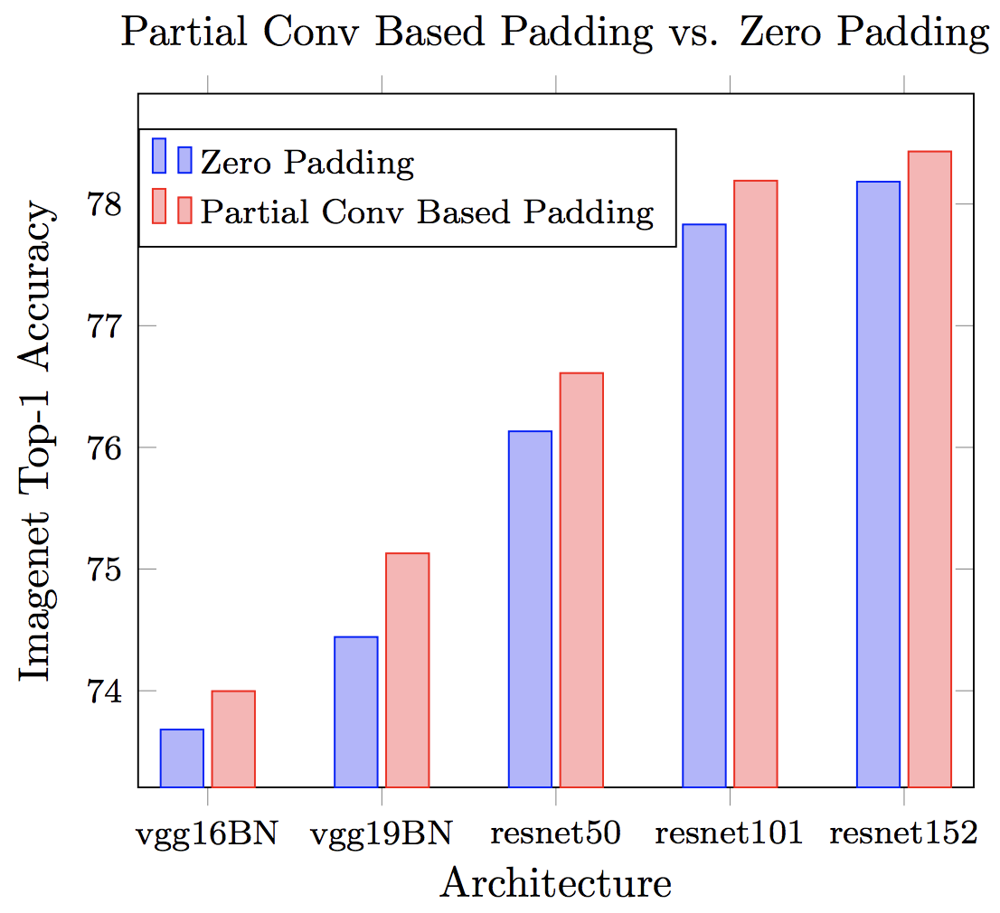
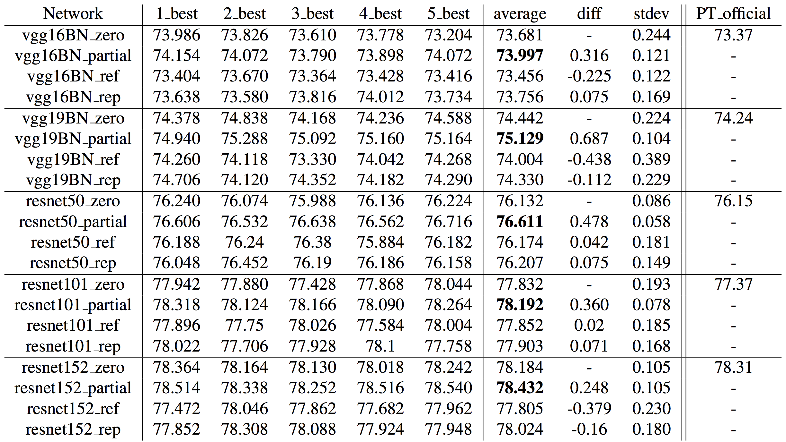

# Partial_Conv-Tensorflow
Simple Tensorflow implementation of [Partial Convolution based Padding](https://arxiv.org/abs/1811.11718)


## How to use
```python
  # typical convolution layer with zero padding
  x = conv(x, channels, kernel=3, stride=2, pad=1, pad_type='zero', use_bias=True, scope='conv')
  
  # partial convolution based padding
  x = conv(x, channels, kernel=3, stride=2, pad=1, pad_type='partial', use_bias=True, scope='conv')

```
## Results
### Activation map


### ImageNet Classification
<div align="">
  
  
</div>

### Segmentation


## Author
Junho Kim
