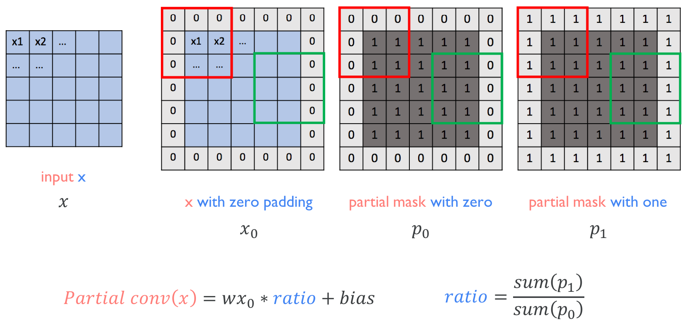
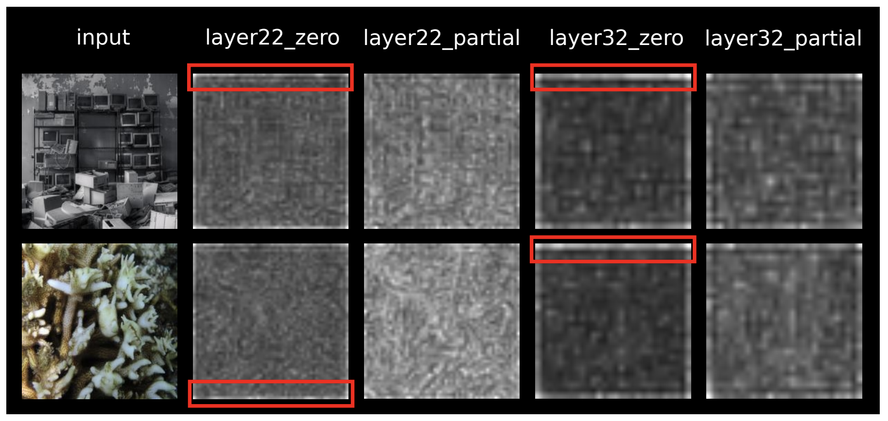
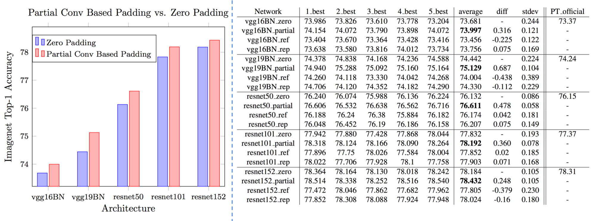
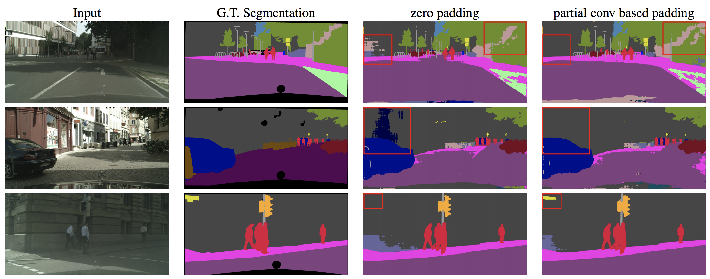

# PartialConv-Tensorflow
Simple Tensorflow implementation of [Partial Convolution based Padding](https://arxiv.org/abs/1811.11718)


## How to use
```python
  # typical convolution layer with zero padding
  x = conv(x, channels, kernel=3, stride=2, use_bias=True, padding='SAME', scope='conv')
  
  # partial convolution based padding
  x = partial_conv(x, channels, kernel=3, stride=2, use_bias=True, padding='SAME', scope='conv')

```
## Results
### Activation map


### ImageNet Classification



### Segmentation (DeepLab V3+)



## Author
Junho Kim
